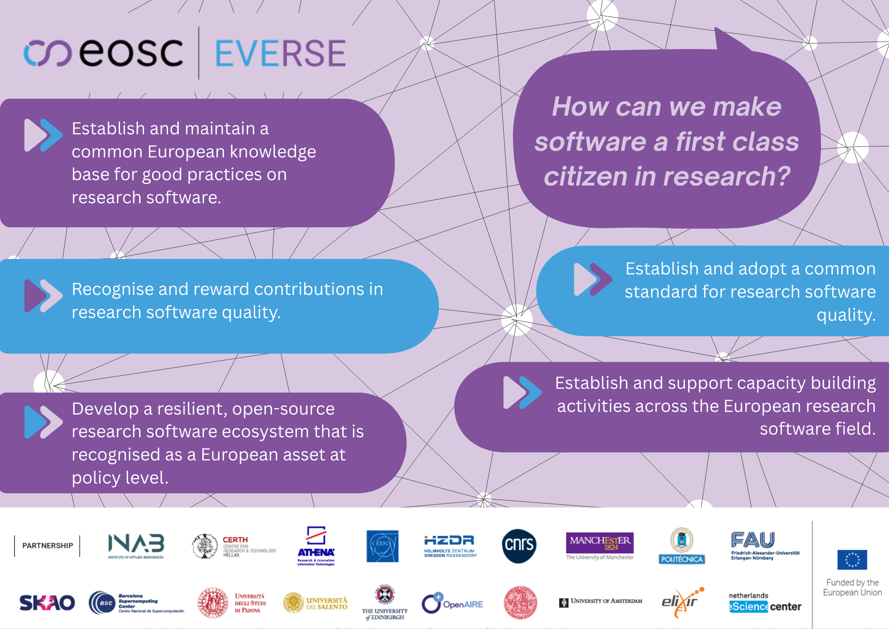

We’ve recently published our latest policy brief!

Through this document, and through the objectives of EVERSE, we are working to ensure that research software that is developed is credited, has proper documentation and can be reused, reviewed and built on by others.

In the brief, we highlight some existing documents such as the Letta Report, Draghi Report, Digital Sovereignty Declaration, ADORE and COARA: positioning our recommendations within the wider European policy ecosystem. It also provides an actionable framework with key recommendations by EVERSE on how this could actually be achieved.

Some of the topics addressed include:

* Why research software is essential for open and reproducible science

* Policy recommendations to support sustainable software development

* Actions for funders and researchers

* Capacity building across research software

  <a href="https://zenodo.org/records/18709939"
     style="background-color: purple; color: white; padding: 10px 16px; text-decoration: none; border-radius: 6px; display: inline-block;">
     Read the policy in full
  </a>

