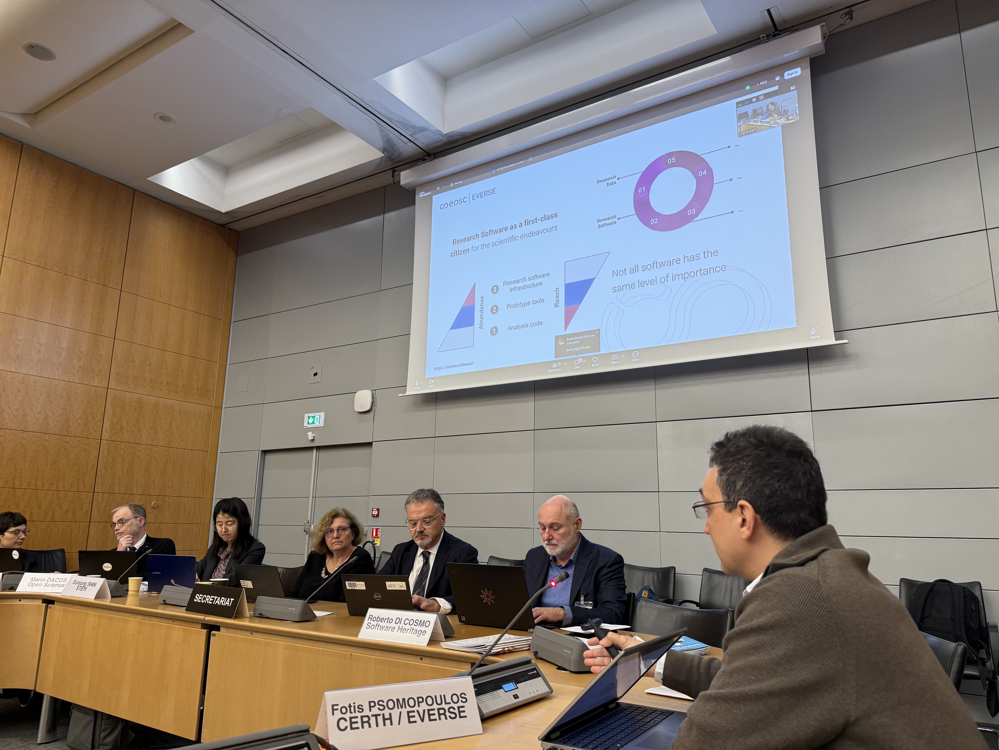

On 6th March, the Organisation for Economic Co-operation and Development (OECD), in partnership with EVERSE and the Research Software Alliance, organised a workshop on policies for research software in the age of artificial intelligence. A diverse range of stakeholders, from across academia, government and the private sector, came to explore policy options that strengthen access to research software and promote open science. 

EVERSE was actively represented in the workshop through various Institutions, including CERTH, University of Manchester, University of Edinburgh, SSI, as well as members of the EVERSE Scientific Advisory Board. 

Fotis Psomopoulos (CERTH, coordinator of EVERSE) presented the current state of national policies and practices related to access to research software. Alongside presenting EVERSE and its outputs, he also highlighted our recently published policy brief, which provides an actionable framework with key recommendations from EVERSE on how to develop research software that is credited, properly documented and can be reused, reviewed and built on by others. 

He explored several topics addressed in the brief, including:

* Why research software is essential for open and reproducible science 

* Policy recommendations to support sustainable software development 

* Actions for funders and researchers 

* Capacity building across research software  

Sessions during the event were structured around key pillars of analysis on access to research software, with EVERSE members playing key roles in moderating the discussions, with key takeaways from each breakout session outlined below:

**Standards and assessment**

Moderated by Fotis Psomopoulos, this session addressed questions such as: 

* How can we identify and converge on critical software standards while respecting research discipline legacy and diversity? 

* What practical mechanisms can be used to embed standards into routine research practice and assessment? 

* What actionable policy interventions and institutional incentives are needed to effectively motivate researchers to share code and adopt standards? 

**Infrastructure**

Moderated by Carole Goble (Professor at the University of Manchester and Joint Head of Node, this session addressed questions such as: 

* How can we identify which infrastructure is critical and at risk? And what shared infrastructure countries should jointly invest in? 

* How can we collectively secure the sustainability of infrastructure (maintenance & long‑term operations) coordinating investments?

* What are the practical and policy obstacles we have to overcome to coordinate infrastructure support and operate collective responsibility? 

**Governance of access to research software**

Moderated by Neil Chue Hong (Principal Investigator and PI and founding Director of the Software Sustainability Institute and co-lead of EVERSE WP3), this session addressed questions such as: 

* Who should be responsible for governance of access to research software? 

* What are the major risks in current research software governance? 

* How can top‑down strategies better support bottom‑up innovation? 

* How should we address IP and legal risks linked to AI-generated code? 

**International cooperation**

Moderated by Michelle Barker (Director of Research Software Alliance and member of EVERSE’s Scientific Advisory Board), this session addressed questions such as: 

* What are the main aspects where international cooperation is needed, and why?  

* What global policy approaches can ensure long-term sustainability of critical research software?  

* How can existing global initiatives align better with national strategies and vice versa? 

**Human resources**

Moderated by Dan Katz (Chief Scientist at the National Center for Supercomputing Applications (NCSA), University of Illinois Urbana-Champaign), this session addressed questions such as: 

* What mechanisms should be used to encourage and enable research software work, particularly as a primary job (e.g. for research software engineers)? 

* What capacity building mechanisms are needed to develop and maintain research software? How can we improve the balance of domain + engineering skills in training? 

* How do we ensure policies recognize people, not just software outputs? 

* Bonus question: how is AI going to change this? 

EVERSE’s presence and participation at the recent OECD workshop was a great opportunity to discuss key topics impacting research software development and its surrounding policy.   

  <a href="https://zenodo.org/records/18709939"
     style="background-color: purple; color: white; padding: 10px 16px; text-decoration: none; border-radius: 6px; display: inline-block;">
     Read our recently published policy brief
  </a>

