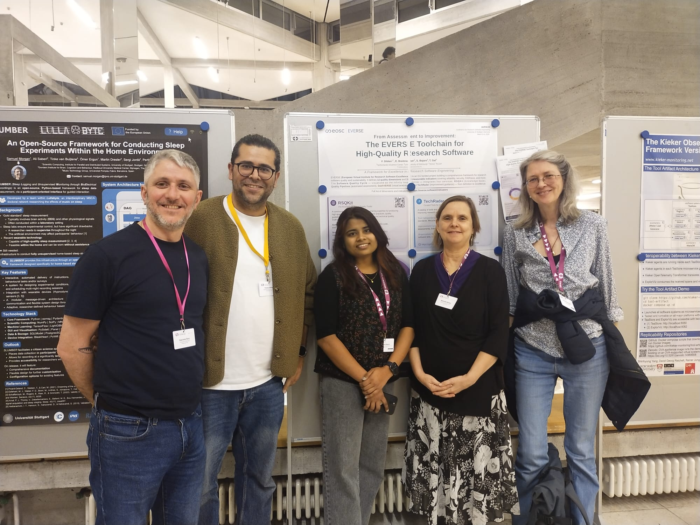

The [deRSE26](https://events.hifis.net/event/2945/overview), the German Conference on Research Software Engineering, took place from 3-5 March at the University of Stuttgart. Several members of the EVERSE community took part, representing EVERSE through a series of talks, demos and posters, both at the [first Stuttgart Research Software Day](https://www.iws.uni-stuttgart.de/en/lh2/conferences-seminars-workshops/research-software-day/) held prior to the conference and during deRSE itself.

[Elena Breitmoser](https://www.linkedin.com/in/elena-breitmoser-33638746/) ([University of Edinburgh](https://www.ed.ac.uk/)), [Faruk Diblen](/about/everse_people/farukdiblen/) ([Netherlands eScience Center](https://www.esciencecenter.nl/team/faruk-diblen/)) and [Shraddha Rohidas Bajare](https://www.linkedin.com/in/shraddha-b-28076a1b4/) ([Square Kilometre Array Observatory](https://www.skao.int/en)) gave a [presentation](https://zenodo.org/records/18864327) on EVERSE’s tools and services for software quality and FAIRness, with a focus on three key tools: the TechRadar, the resqui (EVERSE Quality Pipelines) and the DashVERSE (EVERSE dashboard). Together, these tools aim to guide research software engineers (RSEs) through each step of assessing and improving the quality of their software. 

Faruk Diblen also presented a [demo](https://zenodo.org/records/18937596) on these four key EVERSE tools, sharing with the RSE community through a practical walkthrough of each stage in the workflow and encouraging engagement with the wider community to contribute to advancing and developing high quality research software. EVERSE also had the opportunity to showcase these tools through a poster during the event. 

Here’s a closer look at what each of the tools does…

* [EVERSE TechRadar](https://everse.software/TechRadar/) - An interactive catalogue of tools and services aimed at improving software quality, helping RSEs select the most appropriate solutions to address specific issues they face. 

* [EVERSE Quality Pipelines](https://github.com/EVERSE-ResearchSoftware/QualityPipelines) (resqui) - A tool that can be used to automatically assess a software repository against a set of quality indicators. 

* [DashVERSE](https://www.dashverse.cloud/) - A visual analytics platform that inputs and displays research software quality assessment results from the resqui pipeline, or from your own tool/service, helping RSEs interpret assessment outcomes, identify quality issues and track  improvements to their software quality over time.

[Giacomo Peru](https://www.linkedin.com/in/giacomo-peru-b23896334/) (University of Edinburgh) presented the [EVERSE Reference Framework](https://events.hifis.net/event/2945/contributions/21139/), showing the different ways in which stakeholders can approach research software quality. He outlined EVERSE’s mission and demonstrated how the framework can stand as a comprehensive resource for anyone interested in improving the quality of their software.

>“It was a fantastic opportunity to demo our EVERSE tools and services. We had a lot of insightful conversations with the RSE community in Germany and received feedback that will help us continue to refine and improve our framework for research software excellence,” reflected Faruk.

>“We made many valuable connections across the research software space,” added Giacomo. “I hope that we can present EVERSE’s final outputs at next year’s edition, deRSE27, whose location is yet to be finalised.”

