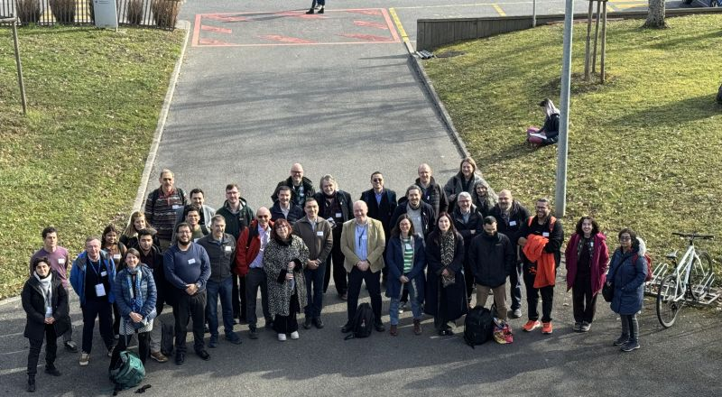

On 5th February, over 70 researchers, software engineers, community managers and industry leaders came together, both at CERN and online, for EVERSE’s first-ever community engagement event. The day offered an opportunity to showcase EVERSE’s tools and services, build connections with the wider European community and help shape EVERSE as it enters its final year.  

The programme was jam-packed with a series of plenary talks, panel discussions and interactive breakout sessions. Keynote speakers from CERN set the stage, outlining the Laboratory’s approach to software development for scientific research as well as its long-standing commitment to open science, which are key topics etched into CERN’s DNA.  

Representatives from EVERSE’s science cluster communities took to the floor, sharing their experiences and challenges currently being faced within their community and day-to-day work: 

* [ESCAPE](https://projectescape.eu/) (astronomy and particle physics cluster) 

* [ELIXIR](/about/partners/elixir/) (representing the life science cluster) 

* [PaNOSC](https://www.panosc.eu/) (photon and neutron science cluster) 

* [ENVRI](https://envri.eu/) (environmental science cluster) 

A series of community lightning talks, featuring [CERN’s Open Source Program Office](https://opensource.web.cern.ch/), the [HEP Software Foundation (HSF)](https://hepsoftwarefoundation.org/) and other projects, also provided the opportunity for knowledge sharing and open discussions. 

Throughout the day, participants had the chance to get hands-on with key EVERSE services such as the [RSQKit]([/services/rsqkit/), [TechRadar](/services/techradar/) and the [EVERSE Training Catalogue](https://everse-training.app.cern.ch/). These live demos gave participants the opportunity to not only find out how the tools work, but also ask questions and provide feedback. Updates were also shared on the current state and future plans of these services, offering a glimpse of what’s still to come.  

Nestled between talks and demos was a panel discussion exploring the state of the research software community, looking at the long-term strategies for sustainability in research software and featuring key voices from within the EVERSE community.  Panellists explored a range of topics integral to research software quality, including training, recognition, policy, funding and sustainability, with the opportunity for open discussions between panellists and participants.  

The event drew to a close with a plenary session summarising and reflecting on the key outcomes and discussions throughout the day, while also looking ahead to the final year of EVERSE and how we can collaboratively continue our mission of developing high quality, sustainable research software across Europe. 

All presentations from the event can be found on the [event page.](https://indico.cern.ch/event/1606722/)

 

