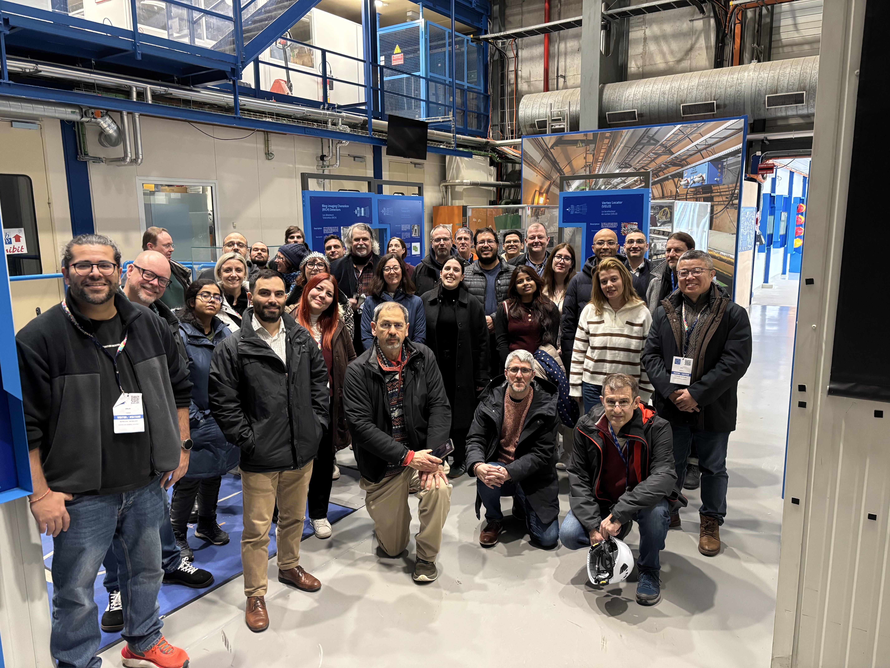

From 3-4 February 2026, more than 40 project members joined in person and online for the second EVERSE General Assembly Meeting.  

Hosted at CERN, the very [birthplace of the World Wide Web](https://home.cern/science/computing/birth-web), the General Assembly was held across two days, covering everything from Work Package updates to demos on EVERSE services. It also provided a valuable opportunity for everyone at EVERSE to get together, for the most part in person, and share their updates, exchange ideas and look ahead to what’s still to come as the project now enters its final year. 

A range of workshops and parallel sessions took place during the General Assembly, with the first day kick-started by each Work Package leader providing their latest updates and progress, while also laying out the foundations for what is ahead.  

To ensure that everyone’s up to speed, here are a few key pointers and updates from each Work Package: 

**WP1:Framework of the European Network of Research Software Quality**  

* Collaboration between WPs is essential to strengthen dissemination efforts, as well as ensuring centralised reporting. 

* Bridging the gap in industry engagement through driving outreach with strategic industry partners. 

**WP2: Community-led best practices for developing high-quality research software**  

* The [RSQKit](/services/rsqkit/) continues to be developed through landscaping efforts, gathering best practices across multiple research clusters – with the goal of integrating the kit into the broader quality pipeline.  

* WP2 is piloting an AI-assisted tool for content creation within the RSQKit, whilst ensuring that the RSQKit remains a standard for best practice for both technical reviewers and policy levers. 

**WP3: Tools and services for software quality and FAIRness** 

* The successful transition from conceptual prototypes to functional services, integrating these components into a “software quality loop”, designed to ensure a cohesive end-to-end experience for researchers and developers.  

**WP4: EOSC Science Cluster Pilots and Driver projects** 

* Developing flexible pathways that tailor quality indicators to each science community’s needs and resource levels, while also exploring synergies with the [OSCARS](https://oscars-project.eu/) project to align open science initiatives with EVERSE standards. 

**WP5: Capacity building and recognition**  

* The curation and expansion of training resources, linking such resources directly to the RSQKit. 

* Future efforts will focus on increasing the volume of available resources while ensuring they are integrated more broadly across EVERSE’s toolset. 

* Ongoing development of the Credit and Recognition Framework, connecting EVERSE with existing recognition services. 

* WP5 is looking to create a multifaceted credit system for maintenance, documentation and community support, whilst exploring how to embed recognition and training elements into everyday coding. 

**WP6: Project management and coordination** 

* Focusing on long-term sustainability of EVERSE tools and resources, working to establish stronger connections between EVERSE tools and their practical application. 

* Ongoing work towards how to integrate EVERSE within the wider EOSC ecosystem. 

After these much-needed updates and with everyone on the same page, a series of demonstrations of EVERSE services, such as the RSQKit and [DashVERSE](/services/dashverse/), followed: 

* The RSQKit demo highlighted its focus as a task-based knowledge hub that aims to connect high-level quality indicators with the practical tools used by the community. The session was really a call to action for the consortium to transition from framework development to enriching them with substantial content. 

* The demonstration of [Resqui]( https://github.com/EVERSE-ResearchSoftware/QualityPipelines) showed the technical heart of the EVERSE software quality loop, with its function of automatic evaluation of research software repositories against quality indicators defined by the consortium. 

* The [DashVERSE]( https://www.dashverse.cloud/) demo aimed to showcase how raw data from the Resqui pipeline can be developed into actionable insights for a range of stakeholders. 

* The [training catalogue](https://everse-training.app.cern.ch/) was also highlighted as a central place for gathering rich learning resources from within the EVERSE ecosystem, working as a one-stop-shop for finding training materials, events and other educational resources.  

During day two, focus shifted more towards the final year of the project, with a number of breakout sessions exploring key topics, such as UX and service integration, the Credit and Recognition Framework and how to continue building momentum and engagement with the science communities.  

Hosting the General Assembly Meeting in Geneva would of course be incomplete without the quintessentially Swiss experience of eating fondue by the lake, coupled with a behind-the-scenes visit to LHCb, one of the four experiments at the Large Hadron Collider.  

**What’s next?**

As we now enter the final year of the project, it’s useful to not only reflect on what’s been achieved so far, but also to look ahead at the upcoming activities and progress in the pipeline throughout 2026, namely the upcoming [Research Software Quality Across Continents](https://indico.cern.ch/category/19377/) event in April (which you can find out more about in our recent [newsletter](/network/newsletter/!) as well as the continuation of our monthly webinar series and a number of events dotted around Europe and beyond.  

