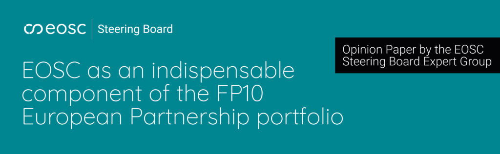

The EOSC Steering Board has made a strong statement of political support for the future of EOSC in FP10 and the role of the EOSC Association. 

The Steering Board’s opinion paper represents the view of delegates from the 42 EU Member States and Associated Countries participating in the current EOSC Partnership, and was released on Monday, 04 May. It advocates for EOSC as a distinct Work Programme-based European Partnership under the European Union’s 10th Framework Programme for Research and Innovation (FP10). 

Titled, EOSC as an indispensable component of the FP10 European Partnership portfolio, the paper lays out a strong case for EOSC as the unique horizontal enabler across the future portfolio of partnerships in FP10. EOSC, it argues, is “a strategic priority for the Union to build a resilient, productive, trusted, secure and sovereign knowledge economy”.

At the core of the Steering Board’s recommendations is a call to “continue EOSC under a Tripartite Governance involving the European Commission, Member States and Associated Countries, and the EOSC Association”. It advocates specifically in favour of including EOSC-A as tripartite representative of the EOSC user communities. Additionally, the paper recommends that EOSC-A be entrusted to coordinate the EOSC Federation.

The EOSC Steering Board recommendations are:

Establish EOSC as a distinct work-programme based European Partnership under FP10. 
	•	Continue to develop EOSC along the five tasks established during FP9. 
	•	Keep the EOSC Federation at the focus of the EOSC development. 
	•	Build a European AI-enhanced ecosystem for science by collaborating and aligning EOSC with EuroHPC, RAISE and other Common European Data Spaces. 
	•	Continue EOSC under a Tripartite Governance involving the European Commission, Member States (MS) and Associated Countries (AC), and the EOSC Association as a representative of the user communities. In a situation where the EOSC Association cannot be partner in the partnership, the EOSC Association should take a strong advisory role in the future governance, ensuring that all three continue to contribute to the steering of EOSC. 
	•	Entrust the EOSC Association with the coordination of the EOSC Federation. 
	•	Aim for a partnership that includes all MS and a significant share of the AC of FP10. 
	•	Foresee a significant contribution from the MS/AC side, while recognising tangible in-kind contributions to the EOSC Federation as a form of partner’s participation. 
	•	Set up the partnership in such a way that partner countries see an investment and financing of activities in their countries at a level at least as high as their contributions with a financial value to the partnership. 
	•	Accompany the partnership, and the continued build-up and operations of the EOSC Federation and its nodes, with widening mechanisms. 

By explicitly endorsing EOSC as a distinct Work Programme-based European Partnership under FP10 and supporting EOSC-A’s mandates as representative of the user community and coordinator of the Federation, the Steering Board signals broad national-level alignment on EOSC’s long-term institutional design and governance.

  <a href="https://doi.org/10.5281/zenodo.20021809"
     style="background-color: purple; color: white; padding: 12px 16px; text-decoration: none; border-radius: 6px; display:flex; width: max-content; justify-content: center; align-items: center; font-size: 16px; line-height: 24px; margin:0;">Full paper can be found on Zenodo</a>
 <a href="https://eosc.eu/news/eosc-steering-board-pushes-for-distinct-work-programme-based-partnership-in-fp10?utm_source=website&utm_medium=referral&utm_campaign=steering_board_opinion_paper "
     style="background-color: purple; color: white; padding: 12px 16px; text-decoration: none; border-radius: 6px; display:flex; width: max-content; justify-content: center; align-items: center; font-size:16px; line-height: 24px; margin:0; ">Read the news article on eosc.eu</a>

