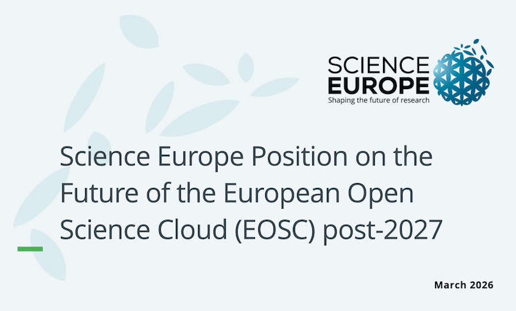

  **Science Europe, representing 40 leading research funding and research performing organisations across 30 European countries, has issued a position statement calling for a clear and robust framework under the EU’s next research and innovation programme, FP10, to secure the long-term future of EOSC.**

  In its statement released on 31 March 2026, [Science Europe](https://eosc.eu/members/science-europe) supports the continuation of EOSC as a European Partnership and stresses the need for early clarity on governance and sustainable funding. The organisation warns that without timely decisions, Europe risks fragmentation and loss of trust among research community and infrastructure providers. 

  <a href="https://scienceeurope.org/our-resources/science-europe-position-on-the-future-of-the-european-open-science-cloud/"
     style="background-color: purple; color: white; padding: 10px 16px; text-decoration: none; border-radius: 6px; display: inline-block;">
     Download Science Europe position statement on the future of EOSC post-2027
  </a>

The endorsement carries significant weight. Science Europe’s [members](https://scienceeurope.org/about-us/members/) are among the largest public research funders in Europe, collectively investing more than €25 billion in research annually. Since 2020, the organisation has also served as an Observer in the [EOSC Association](https://eosc.eu/eosc-association), reinforcing its longstanding engagement with the advancement of EOSC and Europe’s Open Science agenda.

 <a href="https://eosc.eu/news/science-europes-40-members-rally-behind-eosc-partnership-in-fp10"
     style="background-color: purple; color: white; padding: 10px 16px; text-decoration: none; border-radius: 6px; display: inline-block;">
     Read the full article on the EOSC website
  </a>
