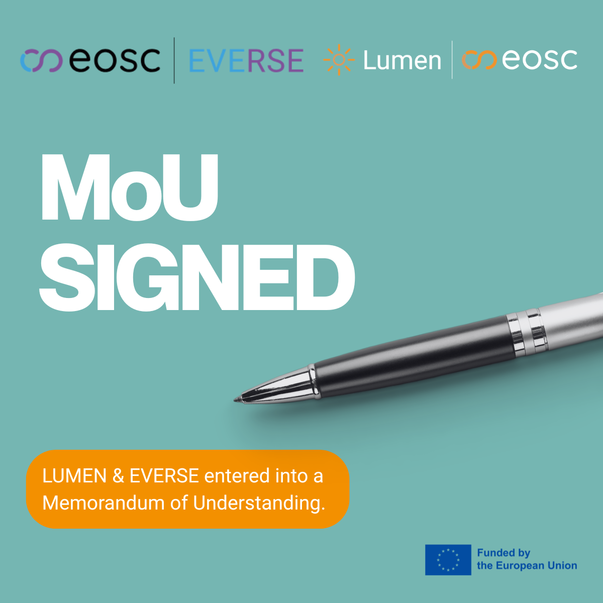

EVERSE has signed a memorandum of understanding with [LUMEN](https://lumenproject.eu/), formalising our shared commitment to making research software a trusted asset within [EOSC](https://eosc.eu/).  

LUMEN is an EOSC project building a cross-domain discovery layer for research software and services, covering a range of topics including maths, molecular dynamics and social sciences and humanities. At EVERSE, we are contributing essential quality frameworks and toolkits, including the [RSQKit](http://everse.software/RSQKit/), that help improve the reliability and reusability of research software.

Together, our joint work for 2026-2027 will focus on three areas:

* Integrating EVERSE-inspired quality metrics and indicators into LUMEN’s software catalogue. 

* Shared development guidelines, using the RSQKit to assess and improve FAIRness, sustainability and quality. 

* Promoting shared standards, such as FAIR Software Indicators, for interoperability across EOSC. 
 
As LUMEN operationalises discovery at the EOSC scale, EVERSE works to strengthen the quality signals that make research software trustworthy and reusable.  
 
Find out more about our collaboration with LUMEN in [this presentation](https://indico.cern.ch/event/1606722/contributions/6898636/attachments/3214112/5725479/20260205_LUMEN_EVERSE%20Community%20Engagement%20Event.pdf) from our [inaugural Community Engagement Event](https://indico.cern.ch/event/1606722/). 
  
