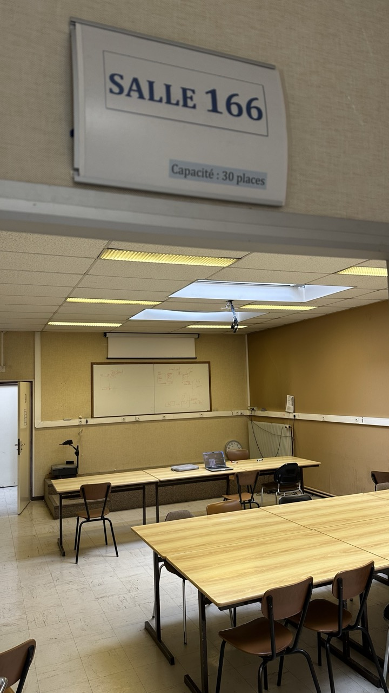

*How can we enhance the user experience of  EVERSE’s Training Catalogue?*

This was a question that arose during EVERSE’s second general assembly meeting back in February, with EVERSE members [Kenneth](https://www.linkedin.com/in/kennethrioja/), [Hugo](https://www.linkedin.com/in/hbacard/) and [David](https://www.linkedin.com/in/davidchamont/) discussing potential ways to enhance the user experience of [EVERSE Training](https://everse-training.app.cern.ch/) and improve access to higher quality training materials.

[EVERSE Training](https://everse-training.app.cern.ch/) is a training catalogue for early career scientists and engineers to learn the best practices when entering the world of research software engineering (RSE). It has been designed to be a one-stop shop for trainees to discover content and for trainers to showcase their training.

With Kenneth’s work as the maintainer and developer of EVERSE Training, Hugo’s focus on designing and building advanced AI systems for training and research software quality, and David’s extensive experience on training in research institutions, together they worked on developing a new feature for the catalogue.

Filling out a lengthy form is what most, if not all, would consider not to be a fun task — and this was the challenge with our training catalogue. Each time a user wants to register a material or an event in EVERSE Training, the form takes a lot of time to go through, asking for a lot of information, such as: a description, learning objectives, trainee prerequisites, key words, and the list goes on — you get the picture. But what actually ends up happening? Less information written on the form,  resulting in fewer details about the training resource to assess its usefulness. 

After exchanging emails, pondering how exactly such changes to the user experience could be implemented, Kenneth and Hugo decided to meet in person in Paris at the  [IJC Lab](https://www.ijclab.in2p3.fr/en/home/) in early May.

Over three days, Kenneth and Hugo  got to work with designing the imagined pipeline on a whiteboard. “For two days, we worked hard to find a solution to improve the Catalogue’s user experience. It felt like a hackathon, with the objective clear in our minds,” explained Kenneth.

And their objective? To set up a Python module that could easily be plugged into the TeSS infrastructure.

Here is the pipeline they came up with:

- Receive information from the form/UI the URL to analyse
- Get the content of this page using [Crawl4AI](https://docs.crawl4ai.com/)
- Filter out associated links to reduce context length (avoiding long compute times) and, more critically, to eliminate "noisy" keywords from URLs — for example, abundant GitHub links could mislead the AI agent into treating "github" as a relevant keyword.
- Do a search and match from a [predefined list of keywords](https://github.com/EVERSE-ResearchSoftware/training/blob/main/csv/keywords.csv) for the keywords
- Feed the content to an LLM-based AI agent to assess the relevance of extracted keywords with respect to the page content.
- Request the agent to [follow a particular schema for the output](https://github.com/kennethrioja/TeSS-Metadata-Extractor-Agent/blob/main/src/prompt_templates.py) (e..g, the output is a JSON, some fields are restricted to a list of selected values)
- Give the output back to EVERSE Training
- Prefill the fields in the UI with the returned values so that the user can review them before registering the material

To find out more details, take a look at the [GitHub repo](https://github.com/kennethrioja/TeSS-Metadata-Extractor-Agent), which follows good practices from the RSQKit, such as:
- [Doing a release](https://everse.software/RSQKit/releasing_software)
- [Getting a DOI for the software](https://everse.software/RSQKit/software_identifiers#getting-a-doi-for-software-hosted-on-github)
- [Adding a CITATION.cff](https://everse.software/RSQKit/citing_software) file

This  working pipeline is currently waiting to be implemented in EVERSE Training. Reflecting on their work, Kenneth and Hugo identify some challenges still to be overcome: “The current pipeline was mainly giving better output using self-hosted models like Gemma4 than the one we could access using [AI4EOSC](https://ai4eosc.eu/) models. We are now looking for non-commercial/institution-hosted models to deploy this feature in production.”

  

  <a href="https://indico.cern.ch/event/1697013/"
     style="background-color: purple; color: white; padding: 12px 16px; text-decoration: none; border-radius: 6px; display:flex; width: max-content; justify-content: center; align-items: center; font-size: 16px; line-height: 24px; margin:0;">Find out more about EVERSE Training in our upcoming webinar</a>

