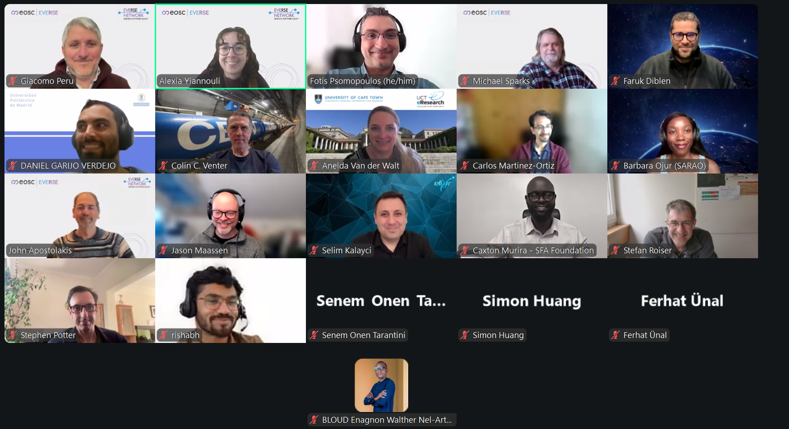

For anyone writing code for research, one of the most essential things to consider is the quality of the software being developed. While EVERSE’s work primarily spans Europe, improving software practices and sharing knowledge extend across continents. 

Organised in partnership with the [University of Cape Town’s eResearch Centre and the Science for Africa Foundation](https://www.google.com/search?q=University+of+Cape+Town%E2%80%99s+e-Research+Centre&oq=University+of+Cape+Town%E2%80%99s+e-Research+Centre&gs_lcrp=EgZjaHJvbWUyBggAEEUYOdIBBzE2OWowajeoAgCwAgA&sourceid=chrome&ie=UTF-8), the main goal of this EVERSE-Africa engagement event was to establish connections and collaborations across continents. Over 40 research software engineers from Europe, Africa and around the world – representing 18 countries – came together online to explore the challenges, best practices and opportunities in improving research code. 

The event kicked off with an introduction to research software quality by [Peter van Heusden](https://www.linkedin.com/in/peter-van-heusden-030b082/) [(University of the Western Cape)](https://www.uwc.ac.za/), who presented the perspective of research software creators. His talk focused on who is making the research software, highlighting the fact that around 80% are male creators from the EU and US. With less than 1% of creators based in Africa, the data highlights a distinct equity gap in who develops and shapes research software. 

A series of short talks from the African community, moderated by [Anelda Van der Walt](http://linkedin.com/in/aneldavanderwalt/?skipRedirect=true) (eResearch Centre, University of Cape Town), brought together a range of voices from across the continent showcasing the breadth of software developed on the continent,  discussing the challenges faced in creating research software and exploring ways of improving its quality. 

[Stephen Potter](https://www.saao.ac.za/astronomers/research_staff/staff-stephen-potter/) [(South Africa Astronomical Observatory National Research Foundation)](https://www.saao.ac.za/) gave insight into how research software quality can be embedded in AI-enabled astronomy and why software quality matters in an observatory – emphasising the importance of reliability, reproducibility, sustainability and human oversight in testing the quality of the software. 

Bringing a slightly different perspective, [Gabriella Razzano](https://www.linkedin.com/in/gabriella-razzano-1b714819/) [(OpenUp)](https://openup.org.za/) shared lessons from open source civic technology, identifying some key challenges (such as resourcing and gaps in skills and data governance) as well as opportunities (such as open source software and local collaboration).

[Barbara Ojur](https://www.linkedin.com/in/barbara-apili-o-aa873777/?skipRedirect=true) ([SKAO](https://www.skao.int/en), [SARAO)](https://www.sarao.ac.za/) highlighted the importance of starting with asking “why” to guide code development, emphasising that the difference between good software and meaningful software is purpose. 

Moving on to explore usability as a key tool to unlock the potential of research software, [Paul Korir](https://www.linkedin.com/in/paul-k-korir-5a8428135/) [(CEMA, University of Nairobi)](https://cema-africa.uonbi.ac.ke/) asked the question: ‘what should we do?’ when developing research software, offering suggestions such as placing usability as a key deliverable and investing in design skills.

Following this series of interesting and insightful talks, EVERSE members presented a comprehensive overview of tools and services such as the [RSQKit](https://everse.software/services/rsqkit/[) and ]TechRadar](https://everse.software/services/techradar/). Breakout sessions then gave participants the opportunity to share their perspectives and discuss the indicators and good practices for research software quality. 

Looking back on the breadth of discussions and insights shared throughout the day, it is evident that research software quality is a globally relevant concern – one that stands to benefit significantly from stronger international collaboration and more deliberate knowledge exchange.

If you would like to listen to the talks from the event, the full recording is available to watch on [EVERSE’s YouTube channel.](https://www.youtube.com/watch?v=UNNfXN_hRMo&t=6202s)

All [presentation slides and useful resources](https://indico.cern.ch/event/1636332/) can be found on the event page.