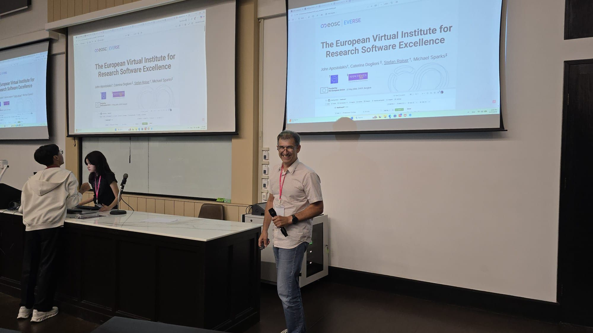
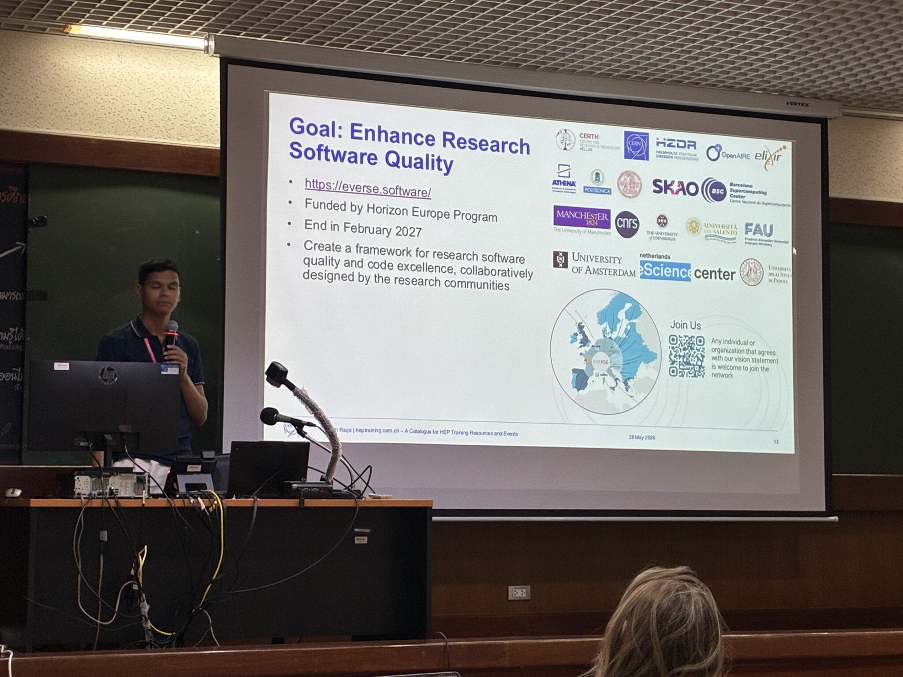
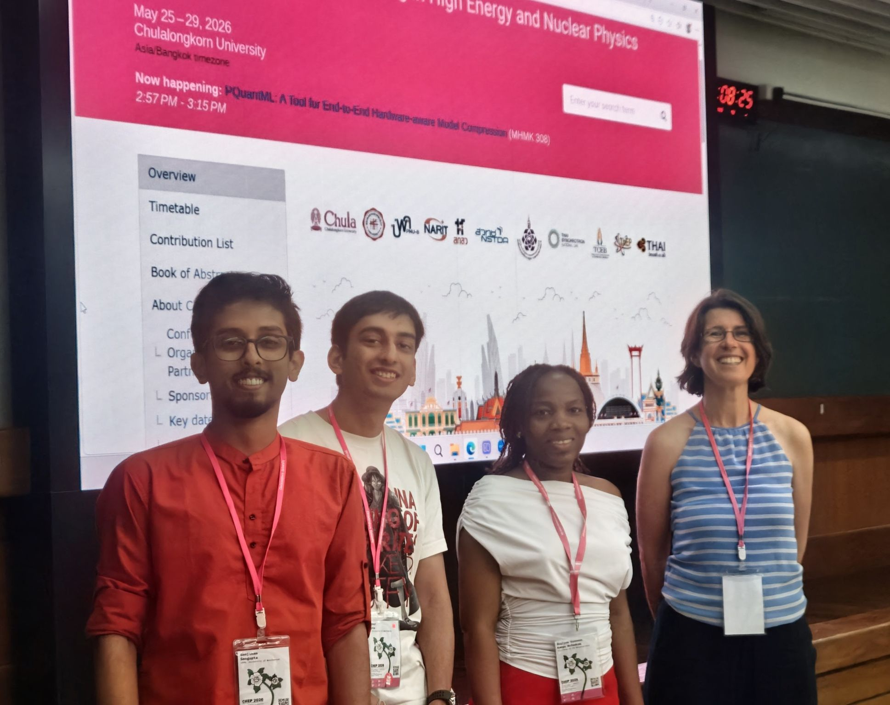

What is EVERSE? And how can trainers and researchers discover training and educational materials through EVERSE’s training catalogue? 

These were some of the questions raised this week at the [28th Conference on Computing in High Energy and Nuclear Physics (CHEP) 2026](https://indico.cern.ch/event/1471803/), held at the Chulalongkorn University in Bangkok, Thailand from 25-29 May 2026.

CHEP is a long-standing conference addressing the computing, networking and software challenges of large-scale, data-intensive scientific experiences, bringing together computing experts in particle and nuclear physics from around the world. This year, EVERSE was represented by several members of the project, who had the opportunity to showcase the role and contributions of EVERSE within the High-Energy Physics community

[Stefan Roiser](/about/everse_people/stefanroiser/) (EVERSE WP5 lead, CERN) gave an overview of what EVERSE is doing to improve research software quality, highlighting EVERSE tools and services such as the [RSQKit](/services/rsqkit/), [DashVERSE](/services/dashverse/) and the [TechRadar](/services/techradar/) — showing how researchers can assess and improve their software quality and get proper recognition for it. He explained the current usage of EVERSE within the High Energy Physics community, such as the interaction with the HEP Software Foundation and the data lifecycle panel of the [International Committee for Future Accelerators (ICFA).](https://icfa.hep.net/)

[Kenneth Rioja](/about/everse_people/kennethrioja/) (EVERSE Developer of Training Infrastructure, CERN) presented [EVERSE Training](https://everse-training.app.cern.ch/): a training catalogue for early career scientists and engineers to explore the best practices in research software engineering and find tutorials, workshops, schools, and other educational resources all in one place. Built on the open source TeSS framework and deployed at CERN, it is one example of how EVERSE is working to make research software education and resources accessible to the research software community.

[Caterina Doglioni](/about/everse_people/caterinadoglioni/) (EVERSE WP4 co-lead, University of Manchester) also presented at CHEP on behalf of the ICFA Data Lifecycle panel, sharing key recommendations for data preservation and open science in high energy physics - aligning strongly with the work that EVERSE is doing. 

Joining Caterina at CHEP were her students, [Sanjiban Sengupta](https://www.linkedin.com/in/sanjiban-sengupta/) (CERN), [Akshat Gupta](https://www.linkedin.com/in/akshat-gupta-mu/) (University of Manchester) and [Bralyne Vanessa Matoukam](https://www.linkedin.com/in/bralyne-vanessa-matoukam-929a8818a/) (University of Witwatersrand), who also presented at the conference. 

