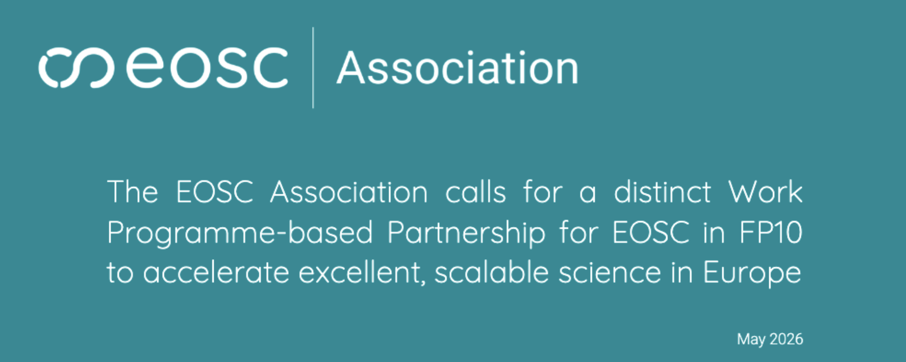

The Association’s position paper, [The EOSC Association calls for a distinct Work Programme-based Partnership for EOSC in FP10 to accelerate excellent, scalable science in Europe](https://zenodo.org/records/20485703), was adopted unanimously by the [EOSC-A General Assembly](https://eosc.eu/) at its 13th meeting, held on 28-29 May in Brussels.

The policy paper is released in the context of the EU-wide negotiations on the EU’s proposed 10th Framework Programme for Research and Innovation (FP10). It presents the EOSC-A membership’s shared vision for EOSC by calling on decision-makers to support the establishment of a distinct Work Programme-based Partnership for EOSC under FP10, with EOSC-A as an equal partner alongside the Member States, Associated Countries and European Commission within the Partnership’s tripartite governance. It reasons that this basis is the best way forward to sustain the momentum generated in the wake of the 2025 launch and 2026 expansion of the EOSC Federation, and to capitalise on the achievements and progress of significant prior investments made across European, national and organisational levels.

The paper goes on to describe the unique and indispensable role EOSC will play in FP10 as the recognised Common European Data Space for Research and Innovation. As such, EOSC is essential to securing European sovereignty over its research data, strengthening resilience in science and innovation, enabling a globally competitive and trusted European AI ecosystem, and accelerating the development of a genuine EU Single Market for knowledge and innovation.

EVERSE fully supports the EOSC Association's call for a distinct Work Programme-based Partnership for EOSC under FP10. A well-governed, federated EOSC is essential infrastructure for the research software community, providing the foundation needed to make software a first-class research output across Europe.

  <a href="https://zenodo.org/records/20485703"
     style="background-color: purple; color: white; padding: 12px 16px; text-decoration: none; border-radius: 6px; display:flex; width: max-content; justify-content: center; align-items: center; font-size: 16px; line-height: 24px; margin:0;">Full paper can be found on Zenodo</a>

