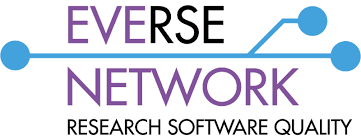
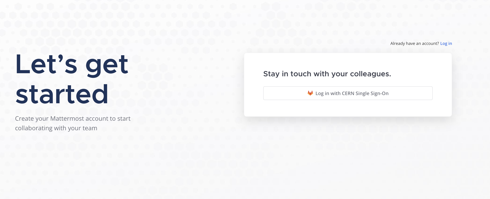
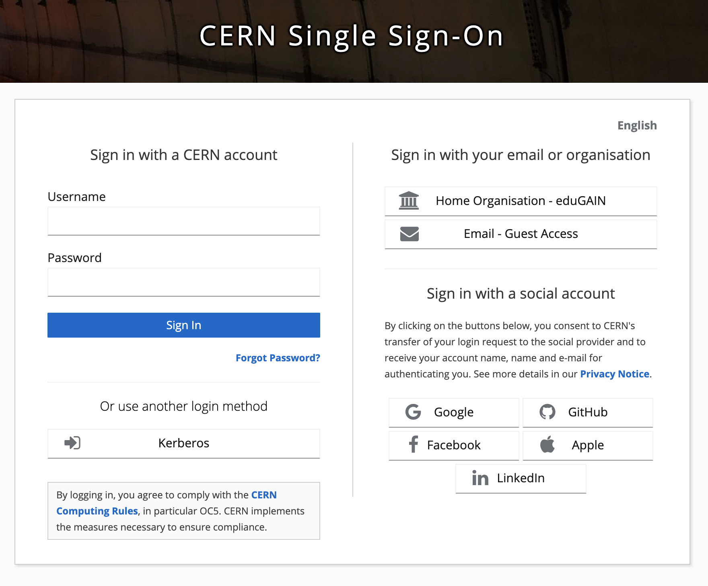

  

The Mattermost instance currently hosted by Helmholtz will be discontinued on 15 July. We are migrating to a new instance hosted by CERN. The channels and layout will remain the same. Please create your account on the new CERN-hosted instance as soon as possible, and **no later than Friday 3rd July**, to ensure continuity. Please follow the instructions below.

To help you in the process of moving platforms, we have included all the information and steps you will need to create your account. 

**How do I join?**

***Step 1***
Click on [this invite link to join.](https://mattermost.web.cern.ch/signup_user_complete/?id=&md=link&sbr=su)

***Step 2***

Click the button ‘log in with CERN single sign-on’

  

***Step 3***

After clicking ‘log in with CERN single sign-on’, you will see a range of options on the right hand side for creating your account.

  

If you do not have a CERN account, ignore the ‘sign in with a CERN account’ section and instead select one of the options on the right hand side of the screen.

**There are a number of ways you can create a CERN mattermost account:**

* Your home institution (eduGAIN)
* Email - CERN guest access (we do not recommend using this option unless none of the other options work for you)

***Or you can sign in with your social account:***
* Google
* GitHub
* Facebook
* Apple
* LinkedIn

**Here is some additional information for signing in with your organisation or through a social account:**

***Joining through your institution***
* Type in or select your institution
* Sign into your account and follow the steps to create your account

***Creating a guest CERN account***
* We don’t recommend this option unless the others did not work for you
* Click ‘register’ at the bottom and follow the stepss to create your account

***Social accounts***
* Sign into your account as you would normally and follow the steps to create your account

***What happens once I’ve created my account?***

Once you have logged in and created your account, please join the **Town Square channel only** for now. This is where we will share updates, events, and relevant information for the Network. 

If you have any concerns or questions about this process of moving platforms and joining the new Mattermost channels, please don’t hesitaste to [reach out to us.](mailto:everse-network-admin@cern.ch)

