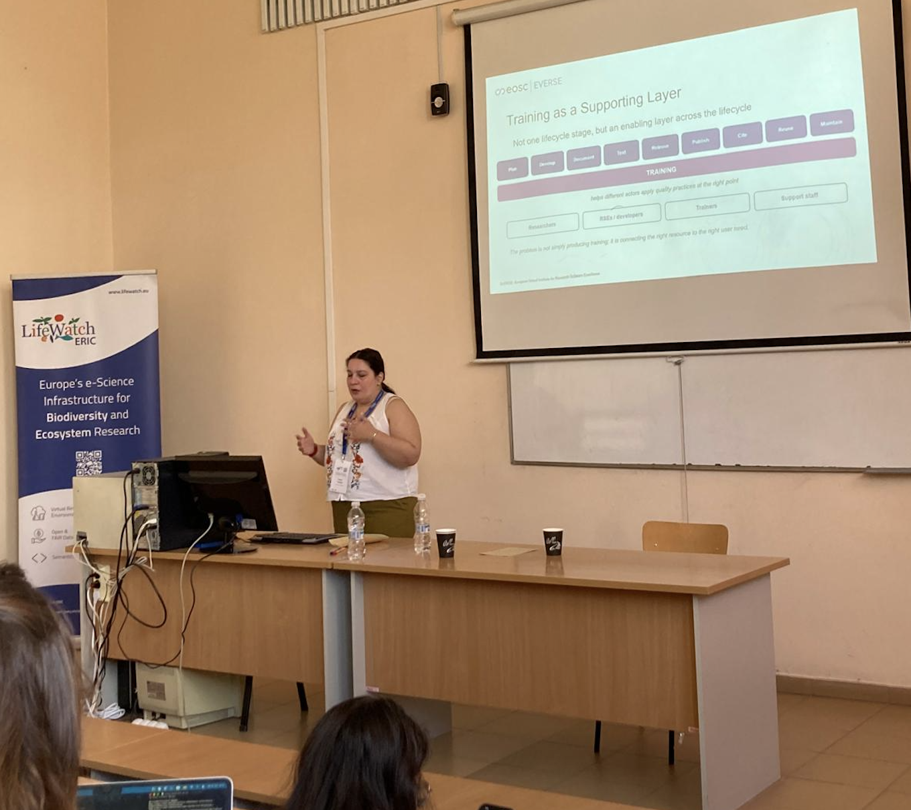
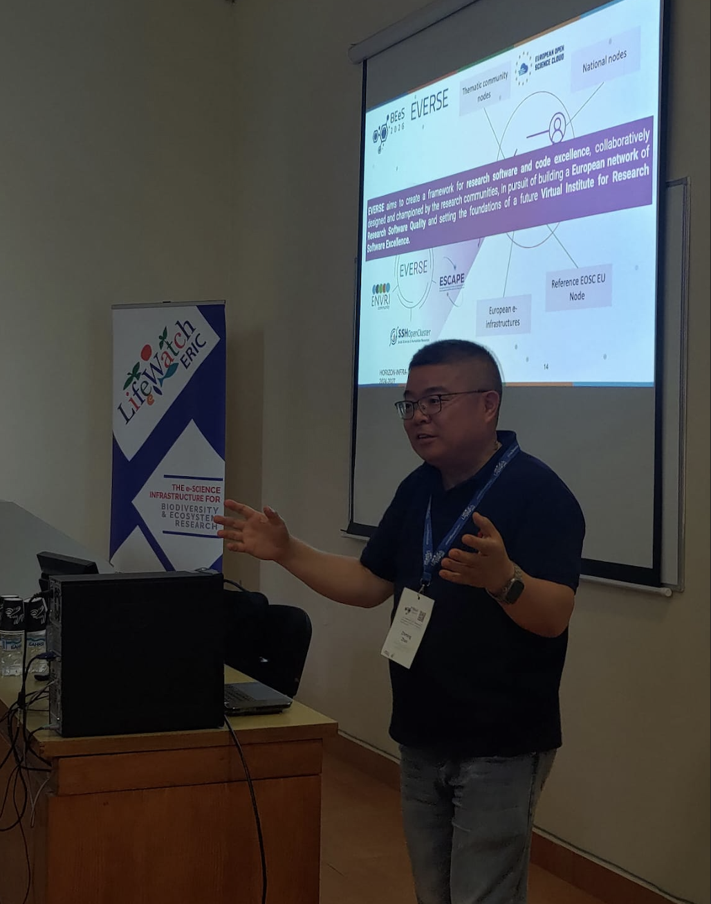

Research software plays an essential role in accelerating scientific progress, but more often than not, the importance of its quality, and of the people developing it, goes unrecognised. EVERSE is addressing this gap by building a collaborative framework for research software and code excellence, including the Research Software Quality Toolkit ([RSQKit](https://everse.software/RSQKit/)), curating best practices, tools and training resources for research communities across disciplines.

Recently, several EVERSE members showcased their tools and services at the LifeWatch ERIC Biodiversity and Ecosystem eScience (BEeS) Conference, which took place 7-10 July in Plovdiv, Bulgaria. 

**Introducing the EVERSE research software quality model and toolkit**

In a training session titled “The EVERSE research software quality model and toolkit”, [Eleonora Parisi](/about/everse_people/eleonoraparisi/) (LifeWatch ERIC) and [Zhiming Zhao](https://www.linkedin.com/in/zhiming72/) (University of Amsterdam) spoke to researchers and research software engineers (RSEs) from environmental and biodiversity sciences, giving a hands-on introduction on using tools to identify and examine research software quality indicators and dimensions. 

Participants were introduced to software in the research lifecycle, as well as the challenges faced in its development. They also learned more about the RSQKit and its community-based approach to research software quality control, with an initial focus on EOSC-linked science clusters such as ENVRI and LifeWatch. Covering things such as reproducibility, maintainability and FAIR research software, the RSQKit can be used by researchers and RSEs to identify key steps they can take to improve the quality of their software. 

The hands-on part of the session gave participants the opportunity to work with these concepts in the [LifeWatch Virtual Lab](https://beta.naavre.net/vreapp/vl/jupyter-quality), which is an online platform where researchers can combine data, workflows and tools, and explore quality indicators and dimensions on real biodiversity and ecosystem use cases – seeing how these quality checks and metrics could be integrated in the platforms they already use for their research.

**Research software quality training, metadata and semantics**

EVERSE was also represented in a session by [Senem Onen Tarantini](https://www.linkedin.com/in/senem-%C3%B6nen-tarantini-85725462/) (University of Salento) on “Research Software Quality Training in EVERSE: Metadata, Discoverability and Semantic Perspectives”, where she emphasised how research software quality is interwoven throughout the whole research software lifecycle, not just a standalone checkpoint. Senem highlighted how training needs vary between roles and lifecycle stages in research software development and that it is not simply a ‘one size fits all’ approach and needs to be adapted based on the intended audience. 

A key focus of this session was metadata and the idea that training materials need to be described with more structured information than just the title, format, link, and so on. Additional metadata such as target audience, learning outcomes and skill level needed can make it easier to find and reuse training resources. This is the approach being taken by [EVERSE Training](https://everse-training.app.cern.ch/), which is designed as a one-stop shop where trainers and trainees can find RSE-related training materials.

**EVERSE’s role within the LifeWatch and ENVRI communities**

EVERSE’s participation in these sessions during the BEeS Conference shows how research software quality can be integrated into technical platforms (such as the LifeWatch Virtual Lab) and in training platforms that support researchers and RSEs. By connecting EVERSE tools and services such as the RSQKit and EVERSE Training, it also gives insight into how environmental and biodiversity research communities can address and improve their research quality.

[More information about the BEeS Conference.](https://www.lifewatch.eu/bees-2026-programme/)

**Presentation slides**

[The EVERSE research software quality model and toolkit](https://www.lifewatch.eu/bees-2026-presentations/#:~:text=Amsterdam/LifeWatch%20ERIC%20%7C-,Download,-ENVRI%2DHub%20tools)

[Research Software Quality Training in EVERSE: Metadata, discoverability and semantic perspectives](https://www.lifewatch.eu/bees-2026-presentations/#:~:text=University%20of%20Salento%20%7C-,Download,-A%20Concept%2DDriven)

