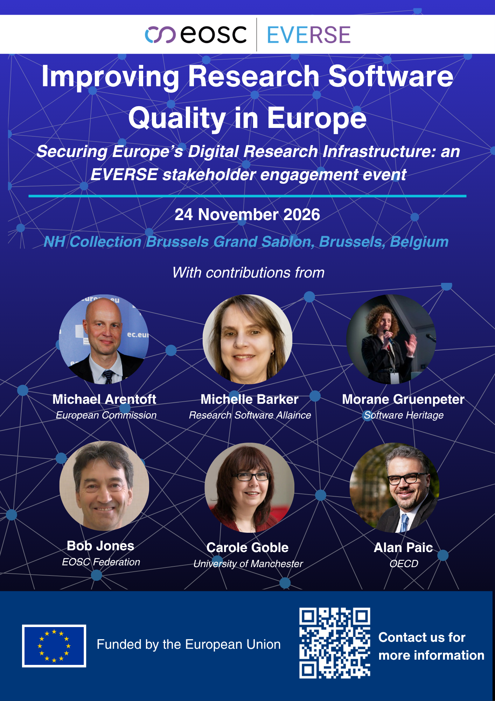

***Registrations open — Improving Research Software Quality in Europe: EVERSE Stakeholder Event, 24 November 2026, Brussels***

We are pleased to announce that registrations are now open for the EVERSE Stakeholder Day, taking place on 24 November 2026 in Brussels. This full-day event brings together researchers, research software engineers, infrastructure providers, funders and policymakers to improve how scientific software is developed, maintained, and valued within the research ecosystem.

The event will feature keynote talks, panel discussions and breakout sessions covering topics such as recognising software as a scientific output, credit and career pathways for software contributors and collaboration across EOSC clusters and initiatives.

**Please note:** places are limited to approximately 40 attendees, allocated on a first-come, first-served basis. Once capacity is reached, we will open a waiting list, so we encourage all interested participants to register as soon as possible.
 

  <a href="https://indico.cern.ch/event/1682301/"
     style="background-color: purple; color: white; padding: 12px 16px; text-decoration: none; border-radius: 6px; display:flex; width: max-content; justify-content: center; align-items: center; font-size: 16px; line-height: 24px; margin:0;">Find out more about the event</a>

 

  <a href="https://elixir-events.eventscase.com/attendance/event/index/46251/EN "
     style="background-color: purple; color: white; padding: 12px 16px; text-decoration: none; border-radius: 6px; display:flex; width: max-content; justify-content: center; align-items: center; font-size: 16px; line-height: 24px; margin:0;">Register for the event</a>

