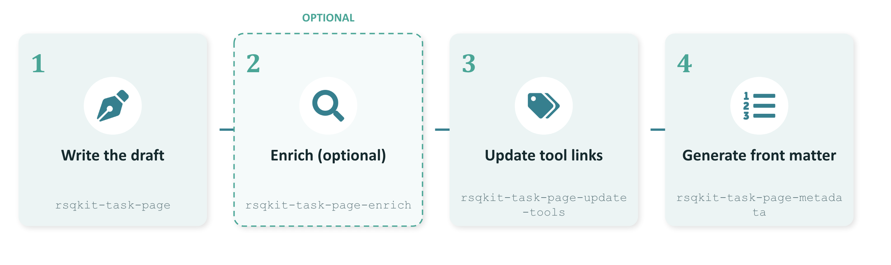

On 30th June, over 20 participants from across the research software community got together for the first [RSQKit Contentathon](https://indico.cern.ch/event/1688339/), an interactive hands-on session focused on improving the [Research Software Quality Toolkit (RSQKit).](https://everse.software/services/rsqkit/)

The Contentathon focused on writing and improving RSQKit task pages,  which are structured guidance pages that help researchers and research software engineers (RSE) understand and act on key software quality topics.

Each page is organised around a specific question, such as “how do you write a good README?” and follows the same structure, which includes:
* A description of the problem and why it matters
* A considerations section covering trade offs and key insights
* A solutions section with actionable steps and pointers to high-quality external resources
* A curated reading list

**Why do these pages matter?**

Research software quality is often considered to be an afterthought, with researchers and RSEs not always having access to practical and accessible guidance on best practices in research software. This is what the RSQKit task pages aim to address, by being self-contained enough to be immediately useful, pointing readers towards external tools, standards, training and community guidance instead of just trying to duplicate them. 

Through this hands-on approach, instead of just starting with a blank page, participants could use Claude AI as an optional tool to generate first drafts of task pages, which they then reviewed and shaped to fit EVERSE’s four-part structure – identifying the problem, considerations, solutions and further reading. 

Rather than being a one-off, the contentathon marks the start of an ongoing effort to capture and share the community's knowledge. The perspectives, lessons learnt, and lived experience of research software engineers and researchers who code are what make RSQKit unique and useful to those working in research.

Following a period of evaluating feedback from the contentathon, this ongoing effort will pick up again in early September, with monthly mini-contentathons and drop-in sessions on the first Monday of each month.

Since you're reading this, your experience is part of the community knowledge we want to capture, and we'd love you to contribute.

**Upcoming RSQKit writing sessions following on from the RSQKit Contentathon:**

* [14th September 2026](https://indico.cern.ch/e/rsqkit-writing-1)

* [5th October 2026](https://indico.cern.ch/e/rsqkit-writing-2)

* [2nd November 2026](https://indico.cern.ch/event/1721370/)

* [7th December 2026](https://indico.cern.ch/e/rsqkit-writing-4)

* [11th January 2027](https://indico.cern.ch/e/rsqkit-writing-5)

* [1st February 2027](https://indico.cern.ch/e/rsqkit-writing-6)

 

  <a href="https://everse.software/RSQKit/
"
     style="background-color: purple; color: white; padding: 12px 16px; text-decoration: none; border-radius: 6px; display:flex; width: max-content; justify-content: center; align-items: center; font-size: 16px; line-height: 24px; margin:0;">Find out more about the RSQKit and how you can get involved</a>

