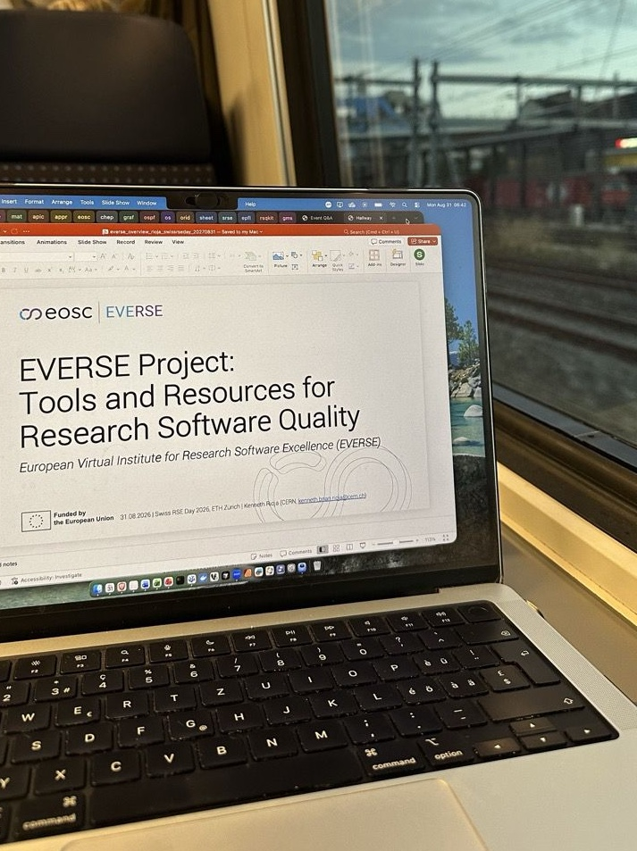
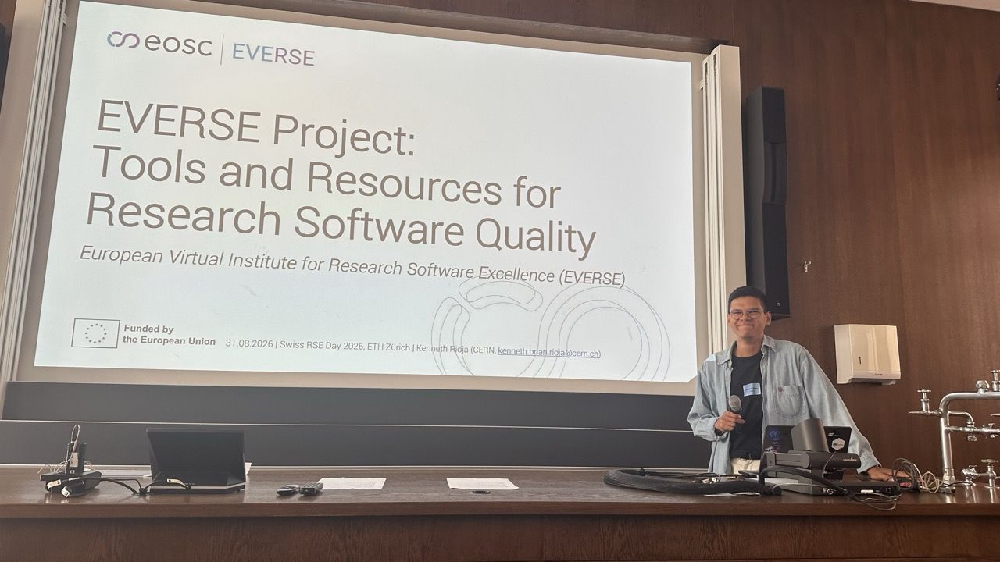
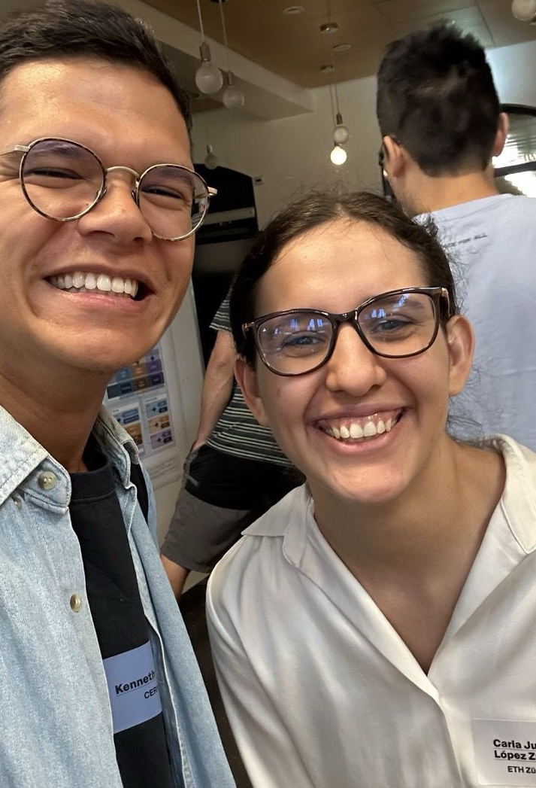

This was a question explored by [Kenneth Rioja](/about/everse_people/kennethrioja/) (EVERSE Developer of Training Infrastructure at CERN), who recently paid a visit to ETH Zurich to attend the Annual Swiss RSE Day 2026. The event brought together RSEs from across academia, research and industry, mostly coming from Swiss HEI, Institute for Research Software or the ReSA.

We asked Kenneth about his experience to find out more. Here’s what he had to say...
 

  

&#8220; The clock hits 5:10, and it’s time to wake up and get ready to travel to the RSE Swiss Day in ETH Zurich (ETHZ). After a three hour train journey, I arrived and went straight to the welcome coffee. 

There, I met two RSEs working in a research group at ETHZ and, over coffee, we already started tackling important topics such as RSE career paths and the fact that RSEs are not researchers, yet some do not end up moving into the private sector.

We discussed how rewarding it is to contribute to science by helping researchers to solve engineering problems, but the lack of support and recognition, or non-competitive salaries, can sometimes lead RSEs to leave academic institutions. 

The first keynote of the day was given by Markus Kreft, who said that “bad code is cheap” nowadays and that as RSEs, our role is to provide the “design, architecture and robustness” of the software delivered. The second keynote from James Dunndalls hit me with this quote: “Data is shared when the value to the creator exceeds the cost to provide it”. 

One particularly special moment of the day was the inauguration of the rse.swiss association, which I was proud to witness. I was happy to see that the board members were equally divided between Swiss Germans and Swiss Romands! 

One thing I will take away is that the RSE community wants more visibility, stronger of the ‘Research Software Engineer’ title and a clearer career path for people falling in the spectrum between ‘Software Engineers’ and ‘Researchers’. Indeed, titles such as ‘Research Software Engineer’ (or even ‘Data Steward’) are not yet widely recognised, although I’ve already started to see job openings that explicitly use the ‘Research Software Engineer’ label.

There is also a huge question mark over the maintenance of research software. Funding agencies need to recognise that the added value of hiring RSEs lies in the robustness they provide. This, in turn, helps avoid people reinventing the wheel, as well as higher costs and longer time spent on onboarding and understanding the code base, and, most of the time, the research intent behind the code. 

On a personal note, I saw one of our summer students from last year, which was a nice surprise!   &#8221;

  

 

  <a href="https://rse.swiss/swiss_rse_day/ 
"
     style="background-color: purple; color: white; padding: 12px 16px; text-decoration: none; border-radius: 6px; display:flex; width: max-content; justify-content: center; align-items: center; font-size: 16px; line-height: 24px; margin:0;">Read more about the Annual Swiss RSE Day</a>

 
